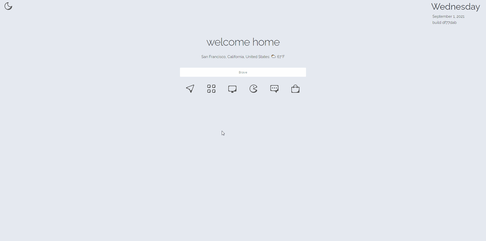

My startpage

# Features
- Custom search sources (google, brave, duckduckgo, wiki, imdb, google images, urbandictionary, goodreads, youtube, amazon, yahoo finance)
- Weather widget based on IP location
- Pastebin and media rehosting dropzone
- URL shortener dropzone
- Recent paste/rehost gallery
- dark/light mode

# running locally

  $ ruby -run -e httpd dist/ -p 3001

# TODO
- google calendar integration
- css animations on submenu and search
- notes via db not localstorage
- robust logging and init script for server 
- sqlite backend
